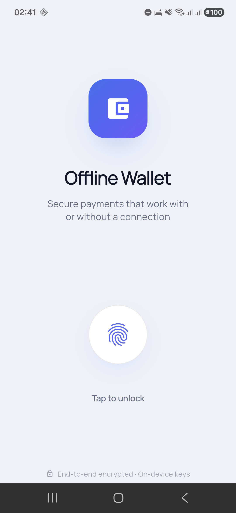
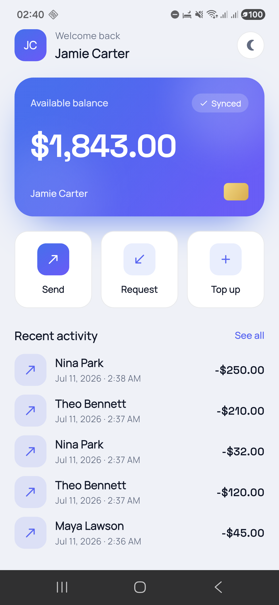
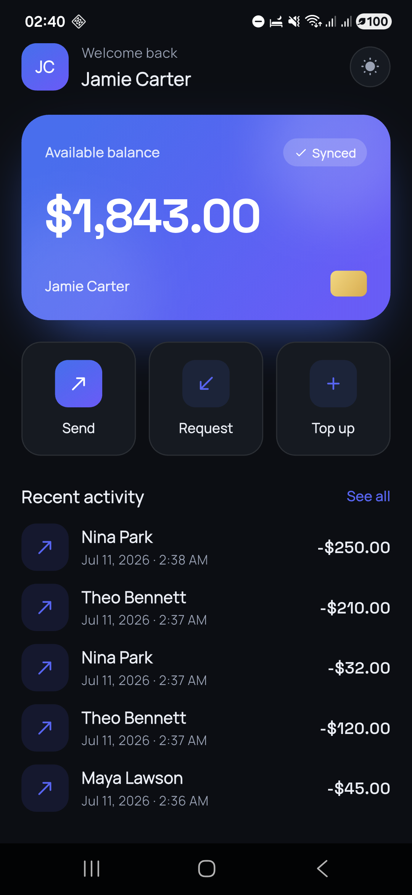
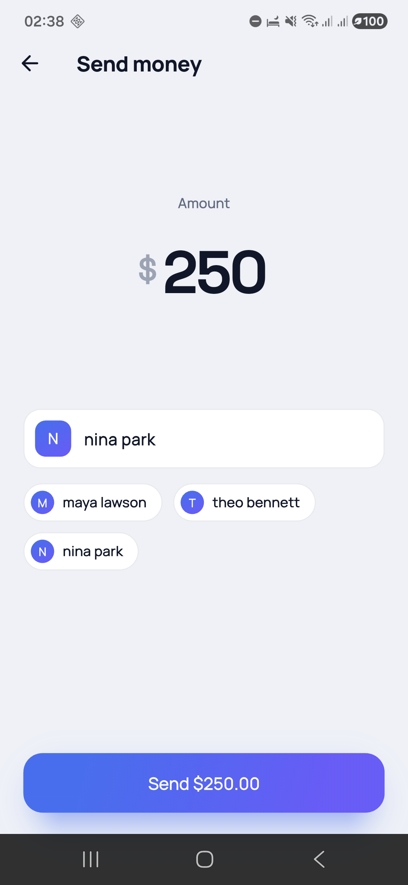
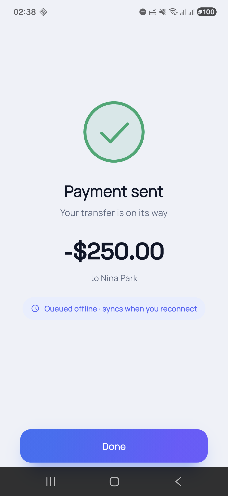

# 💳 Offline-First Wallet — Flutter + Native Android Biometrics

A clean-architecture mobile wallet demonstrating **offline-first data**, **safe money movement**, and a **hand-written Flutter↔Kotlin biometric bridge**

> **Why this repo is different:** most Flutter wallet demos stop at the UI. This one crosses the native boundary (a custom `MethodChannel` to Android `BiometricPrompt`, no `local_auth` plugin) and treats money with the correctness a bank expects (integer cents, atomic DB writes, double-spend protection).

---

## 📱 Screenshots

Captured on a physical Android device (Samsung Galaxy A55, Android 16).

| Biometric unlock | Dashboard (light) | Dashboard (dark) |
|:---:|:---:|:---:|
|  |  |  |

| Send money | Payment sent, queued |
|:---:|:---:|
|  |  |

> The success screen only says *"Queued offline · syncs when you reconnect"* when the transfer is **actually** still in the outbox — a confirmed transfer doesn't claim to be queued. Either way the money moved the instant it hit the local database; that's the offline-first promise made visible.

---

## ✨ Highlights

- **🔐 Native biometric unlock** — Dart calls a custom `MethodChannel` into Kotlin `BiometricPrompt`. Written by hand to prove native Android capability, not just plugin usage. → [`biometric_authenticator.dart`](lib/core/platform/biometric_authenticator.dart) · [`MainActivity.kt`](android/app/src/main/kotlin/com/abdurrahman/wallet/MainActivity.kt)
- **📴 Offline-first, all the way through** — the local SQLite DB is the single source of truth. A transfer is durable the instant it lands there, an outbox worker drains it when the network returns, and refreshing reconciles by transaction id. Not just "cache the reads".
- **💸 Double-spend safe, twice over** — **Bloc with `droppable()`** stops a double-tap firing two transfers; **client-generated idempotency keys** stop a network retry becoming a second debit. Both are tested.
- **🧮 Money done right** — amounts are integer **cents**, never `double`. The balance is *derived*, not stored, so it never flickers when a queued transfer settles.
- **🧱 Clean architecture** — `domain` (entities, use cases, repo interfaces) / `data` (sources, models, repo impl, sync) / `presentation` (Cubit + Bloc). Dependencies point inward only.
- **🎨 Considered UI** — a token-driven design system (`WalletTokens`) with a first-class **light & dark** theme, gradient balance card, and micro-interactions (pulsing unlock ring, press-scale actions). Fintech polish, not a scaffold.

## 📴 What "offline-first" actually means here

Most demos labelled offline-first write to a local DB, set a `synced = false` flag, and stop. Nothing ever reads that flag back. Everything below is the part that usually goes missing.

**The balance is derived, never mutated.**

```
available = confirmed_balance − pending_out + pending_in
```

`confirmed_balance` is written *only* from a server response. A local transfer never touches it — the debit shows up through the pending sum instead. This is what makes the number on screen hold still: when a queued transfer confirms, it leaves the pending set and enters the confirmed balance in the same step, so the net change is zero. Store a mutated balance instead and the user watches their money reappear on refresh and vanish again on sync.

**A transfer has three states, not two.** A `synced` bool cannot tell *"the server hasn't seen it"* (money will move) from *"the server said no"* (money will not move). Those need opposite responses — retry forever vs. never retry — so [`TxStatus`](lib/domain/entities/tx_status.dart) is a sealed `Pending` / `Synced` / `Rejected`, with the retry bookkeeping carried on `Pending`.

**The outbox worker is strictly ordered.** [`SyncService`](lib/data/sync/sync_service.dart) drains oldest-first and **stops at the first transient failure**. Skipping ahead would reorder the ledger, and the server could accept a later transfer it would have declined once the earlier one landed. Backoff is exponential with **full jitter** — without jitter, every device that lost the same carrier retries in the same millisecond — and it lives on the database row, so killing the app doesn't reset it.

**Reconciliation is by id, never by arithmetic.** A dropped reply looks exactly like a dropped request: the server may have applied a transfer the client still thinks is queued. Subtract it from a balance that already excludes it and you show money that doesn't exist. So on refresh the client promotes any local row the server's ledger knows about **before** writing the new balance.

**Nothing is reversed on a guess.** When a transfer exhausts its retries, the worker asks the server's ledger whether it actually landed. If it did, the transfer settles and the queue keeps moving. If the answer is still unknown, the queue **parks and asks the user** rather than refunding money that may really have moved.

**No CRDTs, and that's deliberate.** A single-user wallet where the client only ever appends has no merge conflict — there's a server value plus a local outbox, not two competing versions of one record. Server is authoritative, refetch and re-derive.

## 🧠 State management — deliberate, not default

| Flow | Tool | Why |
|------|------|-----|
| Biometric unlock, dashboard load | **Cubit** | Linear flows; no event log needed |
| Money transfer | **Bloc + `droppable()`** | Event layer gives concurrency control → no double spend |

This "Cubit for the simple 80%, Bloc for the risky 20%" split is a decision I can defend in an interview.

## 🏗️ Architecture

Three layers, one rule: **dependencies point inward.** `presentation` and `data` both depend on `domain`; `domain` depends on nothing. It knows only its own entities and repository *interfaces* — never Flutter, sqflite, or the network.

```
┌─ presentation ───────────────────────────────┐
│  AuthCubit · DashboardCubit · TransferBloc   │  UI + state
└──────────────────────┬───────────────────────┘
                       │ calls use cases
┌──────────────────────▼────────────────────────┐
│                   domain                      │  pure Dart, no deps
│  use cases · entities · repository interface  │  ◀── the contract
└──────────────────────▲────────────────────────┘
                       │ implements the interface
┌──────────────────────┴────────────────────────┐
│                    data                       │  fulfills the contract
│  WalletRepositoryImpl · SyncService (outbox)  │
│    ├─ local  → sqflite   ◀── source of truth  │
│    └─ remote → Fake | Http                    │
└───────────────────────┬───────────────────────┘
                        │ HTTP (optional)
              ┌─────────▼──────────┐
              │  server/  (shelf)  │  reference backend
              └────────────────────┘

core/platform → MethodChannel → Kotlin BiometricPrompt   (native bridge)
```

**Why it's built this way:** the repository interface lives in `domain`, but its implementation lives in `data`. So the transfer use case depends on an abstraction, not on SQLite — swap the data source (or mock it in a test) and `domain` never changes. That's the inversion that keeps money logic testable and framework-free.

The same trick is applied twice more: `WalletRemoteDataSource` is an interface with a chaos-injecting fake and a real HTTP client behind it, and the outbox worker is exposed to the UI as `WalletSync` so presentation never reaches into `data`.

## 🌐 The other side of the contract

Idempotency and reconciliation are **contracts**, and a contract has two sides. Mocking both in one process is self-fulfilling — you never find out the key didn't survive JSON, or that a status code was classified into the wrong retry behaviour.

So [`server/`](server/) is a ~250-line **shelf** backend: in-memory, no database, no deployment. It exists to be run in tests, not hosted.

```sh
cd server && dart pub get && dart run bin/server.dart
```

The load-bearing detail is that a replayed idempotency key returns **`200` with the original body**, not `409`. A replay is the *expected* result of a retry after a lost reply — answering with an error would send the client down its failure path for a transfer that already succeeded, and it would then reverse something that really happened.

It can also fail on purpose:

```sh
CHAOS_DROP_AFTER_APPLY=true dart run bin/server.dart   # apply, then drop the reply
```

That flag produces the ambiguous timeout — the scenario reconciliation exists for, and one you cannot provoke against a real server on demand.

## ▶️ Run it

This project pins its Flutter SDK with **[FVM](https://fvm.app)** (see [`.fvmrc`](.fvmrc)). Install the pinned version once, then prefix Flutter commands with `fvm`:

```bash
dart pub global activate fvm   # if you don't have FVM
fvm install                    # installs the Flutter version pinned in .fvmrc

fvm flutter create .           # generate platform folders once
# add to android/app/build.gradle:
#   minSdkVersion 23
#   implementation "androidx.biometric:biometric:1.1.0"
# then restore the provided MainActivity.kt + AndroidManifest.xml
fvm flutter pub get
fvm flutter run
```

> Running `fvm use` in the project points your IDE at `.fvm/flutter_sdk`.

Demo account is seeded automatically (clean-room fake data — no real PII).

## ✅ Tests

```bash
fvm flutter test                                    # 62 tests, nothing to install
fvm flutter test --tags integration --run-skipped   # + 6 against the real server
```

The default run uses the in-process fake: fast, deterministic, and able to produce failures a real server won't reproduce on demand. The integration tier boots [`server/`](server/) and talks to it over real HTTP — reserved for the claims that only mean something across a process boundary.

The tests worth reading, because each one pins a property that is easy to break and hard to notice:

| Test | Property |
|------|----------|
| Balance identical before and after a queued transfer syncs | **No flicker** — the reason the balance is derived |
| Server applied it, reply lost → refresh shows `240000`, not `230000` | **No double-count** — reconcile by id, not arithmetic |
| Same idempotency key twice → one debit | **No double-spend** on retry |
| A fails transiently, B queued → B is not sent | **No ledger reordering** |
| Kill mid-backoff, reopen → attempt count survives | Backoff is persisted, not in memory |
| Three offline transfers > balance → third refused | Can't overdraw while disconnected |
| Retries exhausted, server *does* have it → settles, no parking | Never reversed on a guess |
| Double-tap Send → use case runs once | `droppable()` holds |

## 📦 Tech

Flutter · Dart · flutter_bloc · bloc_concurrency · get_it (DI) · dartz · sqflite · connectivity_plus · http · shelf (reference server) · Kotlin (BiometricPrompt) · GitHub Actions CI

---

*Built by Abdurrahman Jundullah M — mobile engineer (Flutter + native Android), 8+ years, fintech/banking background.*
